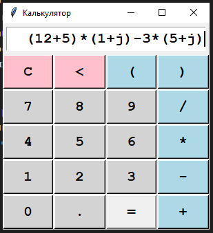

# Команда:

* Санников Александр
    
    Модуль calc_window.py

* Крутов Влад

    Модуль operations.py

* Малетин Василий

    Модули controller.py, logger.py

# Описание работы программы

Программа калькулятор вычисляет значение введенного выражения. Возможно вводить несколько операций за раз. Калькулятор имеет возможность работать с вещественными и комплексными числами. Какой режим работы (Комплексный или рациональный), калькулятор определяет самостоятельно и сам переключается между ними.

При запуске выводится окно калькулятора для взаимодействия с пользователем. 

Окно содержит:
* кнопки всех цифр от 0 до 9
* кнопку мнимой единицы для комплексных вычислений
* кнопки всех основных операций +, -, *, /
* кнопки скобок для возможности приоритезации операций (, )
* кнопки для коррекции данных: C - очистка поля, < - для удаления последнего символа

Все строки для вычисления и результаты вычисления, а также ошибки вычисления (если возникали) фиксируются в лог-файле log.csv с указанием времени операции

